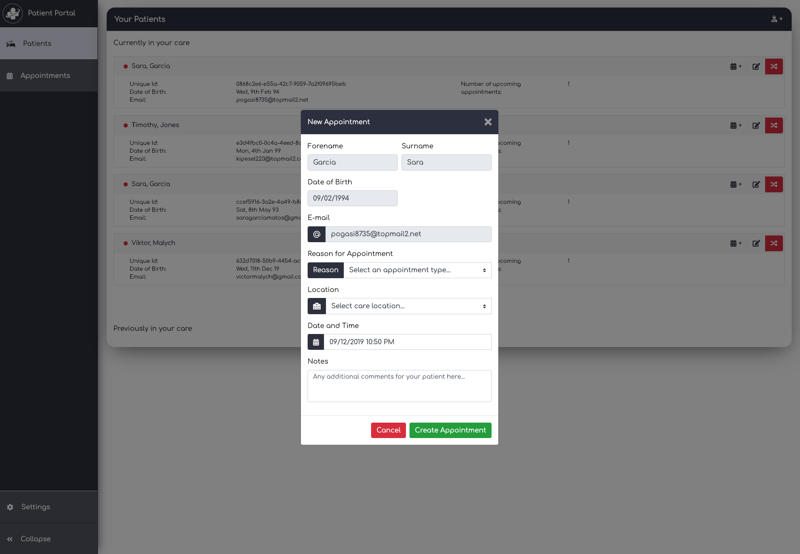

## Patient Portal
---

Welcome to the Patient Portal GitHub repository. <br />
Please read the following file to get an idea of the functionality and how to use the platform.

### Testing in multiple tabs
---
In order to fully appreciate the features added to the platform the advised approach for testing the application would be to have 2 browser windows. I have my dev environment such that 2 windows are 2 separate processes to avoid caching issue with regards to sessions. <br />

I then sign in as a clinician to one, and as a patient of that clinician in the other window. You'll then be able to see as the clinician that your patient is online, and also be able to send them notifications about upcoming appointments.

### Features
---

1. **Logging in**

Patient Portal is a closed system. This means that only users having been granted access with an invitation can join the platform. Based on their invitation access level, they will have access to different parts of the platform. In order to login, either click on "login" on the welcome page as seen below, or head to:  "```http://webtech-10.napier.ac.uk/auth/login```" and enter some credentials (either from the credentials below or some that you've created yourself).

2. **Invite a new Patient**

If you have logged in as a Clinician, you will have the ability to invite new patients into your care. You'll need to click on the small patient icon on the top right hand corner of the "patients" component of the sidebar: <br />


Once you've clicked on the "Add Patient" button, a bootstrap modal should appear, allowing you to enter the invitee's credentials: <br />

 <br />

For the purpose of testing (and to avoid spamming both myself and my partner's inbox), I used the following temporary mail server: ```https://temp-mail.org/en/```. <br />

If the invite was created successfully, you should get a green "success notification" in your browser like so: <br />

 <br />

If your invite was sent successfully, you should see an e-mail in your inbox (this will most likely go to your spam inbox): <br />

 <br />

3. **Register invitation**
Clicking on the registration link should take you to a confirmation page, where the invited user will get to create some credentials. Please be aware that you'll need to open the e-mail in a different browser, or at least a window where your other session isn't cached: <br />

 <br />

Once your registration is validated, you'll be prompted to return to the home page in order to login with your new credentials. Note that at this point you will be logged in as a patient. Patient accounts currently do not support much functionality other than logging in and out, and receiving live appointment notifications from their clinicians.

4. Create a new appointment
Keeping your patient's session active, open a new browser window (making sure that your not using the same process), and login to your clinicians account. Side by side, you should see something like this: <br />


Note how in the clinician's window, the badge to the left of the patient's name is green. This indicates that the patient is currently online, and means that metadata is currently stored in the clinician's client side cache about this patient. This will allows us to send appointment updates in realtime to this patient's account. In order to see this in action, let's create a new appointment. <br />

Clicking on the new appointment button on the patient that is online, a new bootstrap modal should open up like this: <br />

 <br />

Once the appointment has been created, both the clinician and the patient (if online) will get a live update in each of their appointment lists: <br />

 <br /> 

Clicking on the "Appointments" tab in the sidebar should also bring you to the clinician's appointments where you will get a summary of this user's upcoming appointments. Looking through the list, you should see the newly created appointment: <br/>

 <br />

5. Delete an upcoming appointment

Clinicians can also delete appointments that are still upcoming. Let's demonstrate this by deleting the appointment we just created. Both the clinician and the patient will be notified of the deletion, and the appointment will be removed from both user's DOM. Note that in future versions of the patient portal app, this will only cancel appointments, not actually delete them. <br />

When you click on the delete button, you should be the following notification on the clinician's account: <br />

 <br />

When clicking on "OK", the appointment should be delete on both accounts, and both users will be notified on the change: <br />

 <br />

6. Testing the REST API
The application comes with a simple REST API that can be found at: ```http://webtech-10.napier.ac.uk/api/v1.0```. The api isn't yet authenticated, but will be in a later version using JWT tokens.

### Credentials
---

1. Clinicians:
    - **Kevin Johnson :** <br />
        **Email :** vomam43613@mailapp.top<br />
        **Password :** Password_1<br />

    - **Liam Lamb :** <br />
        **Email :** liam.j.lamb@gmail.com<br />
        **Password :** Password_1<br />

2. Patients:
    - **Sara Garcia :** <br />
        **Email :** pogasi8735@topmail2.net<br />
        **Password :** Password_1<br />

    - **Timothy Jones :** <br />
        **Email :** kipesel223@topmail2.com<br />
        **Password :** Password_1<br />

    - **Viktor Malych :** <br />
        **Email :** victormalych@gmail.com<br />
        **Password :** Password_1<br />
