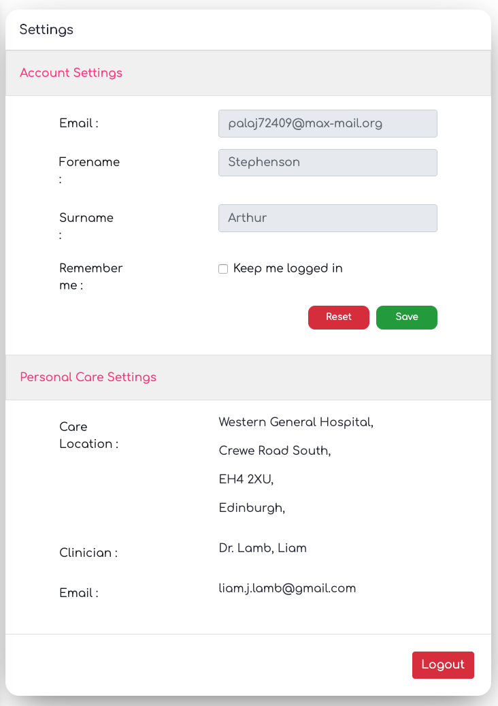

## Coursework Part 2
---

**Screen Shots :**  

Welcome Page:  
  

Login Page:  
  

Dashboard (WIP):  
  

Invitation (Patient):  
  

Appointments (WIP):  
  

Create new Appointments:  
  

Settings (WIP):  
  

Swagger API Docs (WIP):  
  
